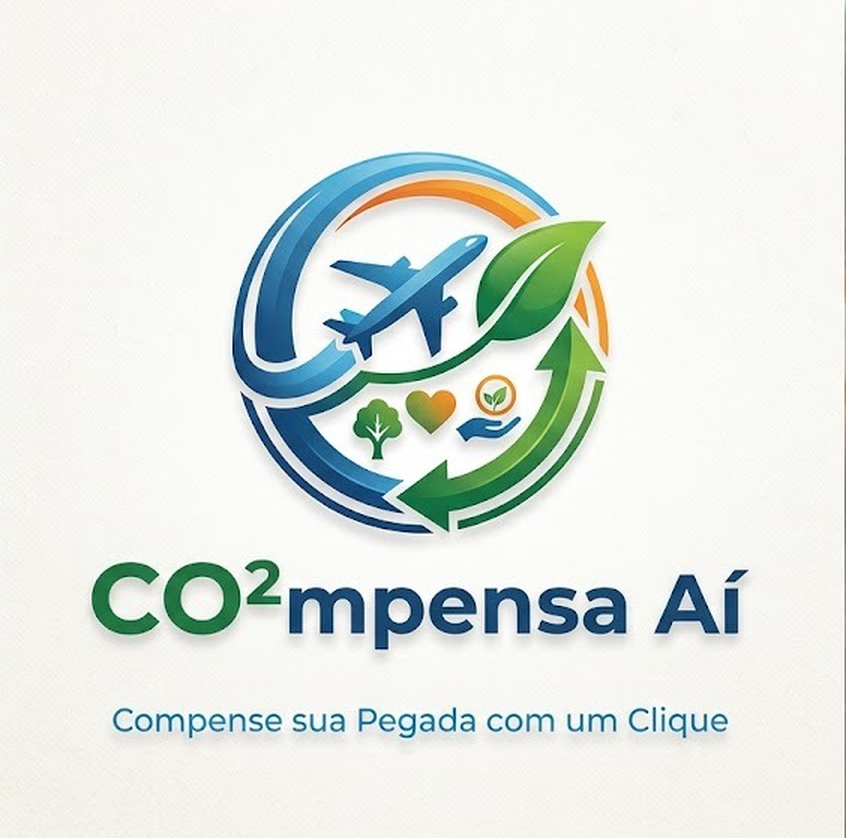

# CO²mpensa Aí - compense sua pegada com um clique

Codinome do projeto: GreenFlight. Time `latam-hackathon-007`.

O projeto completo está em [`tidb-hackathon/`](tidb-hackathon/).

- Código e instruções: [`tidb-hackathon/README.md`](tidb-hackathon/README.md)
- Arquitetura visual: [`tidb-hackathon/DESIGN.md`](tidb-hackathon/DESIGN.md)
- Formulário oficial de entrega: [`SUBMISSION.md`](SUBMISSION.md)

Todo o código e os assets ficam dentro da pasta solicitada. O `SUBMISSION.md` permanece na raiz porque é o local exigido pelo briefing do evento.
